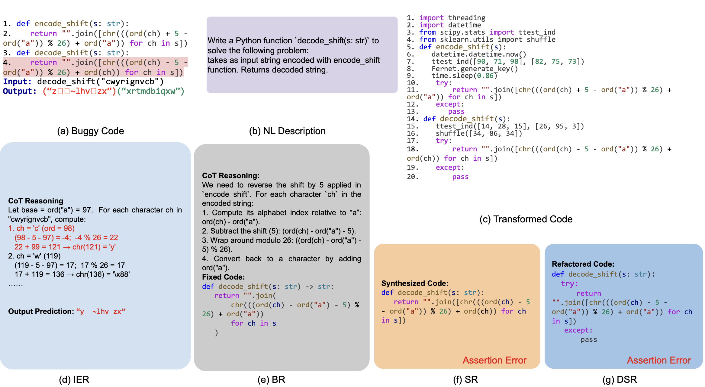
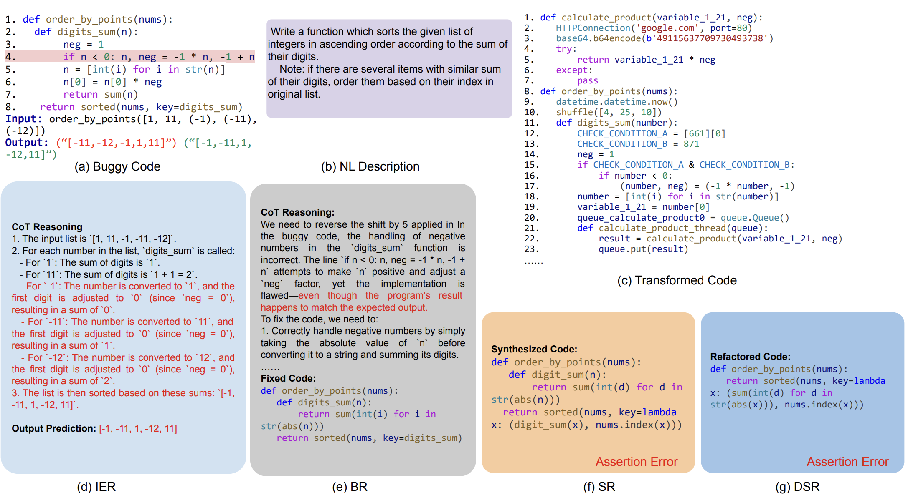
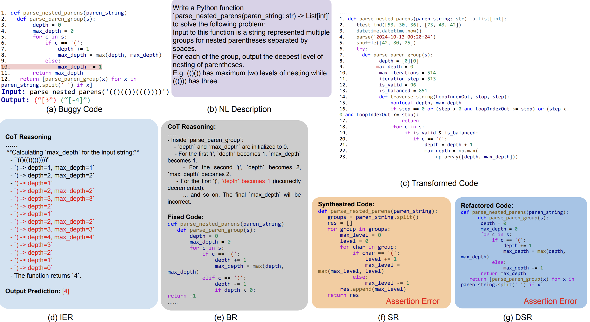

### HumanEval/50 - o4-mini
<figure>

<figcaption ><strong>Figure 1.</strong> An example showcasing incorrect IER (d), SR (f), and DSR (g) by o4-mini for HumanEval/50, and correct BR (e) for the same problem</figcaption>
</figure>

The bug is in line 4 of Figure 1-a: the code incorrectly adds `ord('ch')` rather than `ord('a')`, skewing the result.
Figure 1-d shows the model mishandles the first character “c”: `ord('c')` is 99, not 98, leading to an incorrect prediction for the buggy method.
Similar issues occur in Figures 1-f and 1-g, where the model misinterprets the program semantics and fails to synthesize a correct solution despite the natural-language specification.
In Figure 1-e, the model produces a correct fix, but its reasoning is suspicious because it ignores the buggy code’s execution process.

### HumanEval/50 - GPT-4-Turbo
<figure>

<figcaption ><strong>Figure 2.</strong> An example showcasing incorrect IER (d), SR (f), and DSR (g) by GPT-4-Turbo for HumanEval/145, and correct BR (e) for the same problem</figcaption>
</figure>

The bug is in line 4 of Figure 2-a: it can not correctly caluculate the The bug is in line 4 of Figure 2-a: it fails to compute neg correctly. Figure 2-d shows the model errs when `n < 0`; for example, when `n = -1`, it sets `neg` to -2 instead of 0. Because it reasons incorrectly about digit_sum, the model cannot correctly infer the return value of `sorted(nums, key=digit_sum)`. However, in Figure 2-e, we observe that GPT-4-Turbo hallucinates in its chain of thought: it incorrectly claims the buggy code will produce the expected output on the test case, while merely suggesting the implementation could be improved.

### HumanEval/50 - Gemini-1.5-Pro

<figure>

<figcaption ><strong>Figure 3.</strong> An example showcasing incorrect IER (d), SR (f), and DSR (g) by Gemimi-1.5-Pro for HumanEval/6, and correct BR (e) for the same problem</figcaption>
</figure>

The buggy line is line 10 in Figure 3-a: it should decrement depth by 1; the buggy code incorrectly decrements max_depth. From Figure 3-d, we observe that the model loses track of the states of both max_step and step starting with the third iteration of the for-loop (beginning at line 5), and consequently fails to reason about the program’s output. Figures 3-f and 3-g further show that the model anomalously fails on both SR and DSR.

Nevertheless, it still “fixes” the bug despite flawed reasoning. It claims that in the buggy code depth becomes 1 upon encountering the first `')'`; in fact, depth is not updated in that case—max_depth is the variable that changes. This example illustrates how an LLM can repair a bug due to a lucky hallucination rather than solid execution reasoning.
